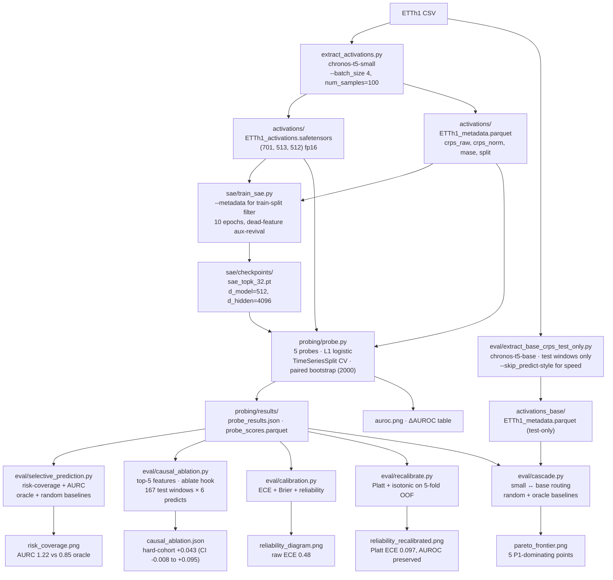
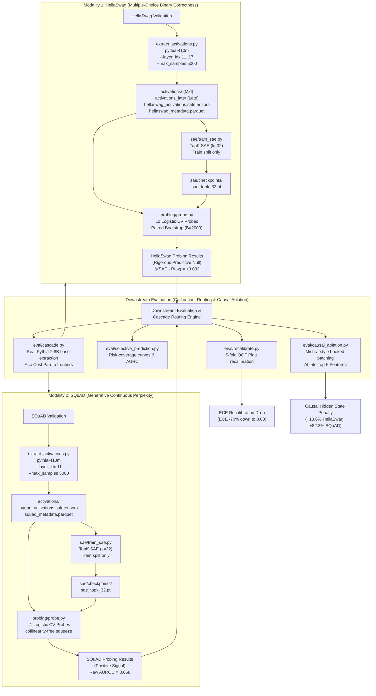

# Feature-Routed Time-Series Forecasting

Sparse-autoencoder features from a Time-Series Foundation Model (TSFM) as a
learned signal for forecast difficulty, routing, and abstention — plus a
Platt-recalibrated selective forecaster, a real small↔base cascade, and a
Mishra-style causal ablation of the top features.

> 📄 **Full technical report (source of truth for methodology & numbers):**
> [`eval/report.md`](eval/report.md). This README is the entry point/overview;
> [`eval/workshop_paper.md`](eval/workshop_paper.md) is the condensed paper.

## Question

Do SAE features add predictive power for forecast difficulty **on top of** cheap
input statistics and raw activations — i.e., does the model's internal
representation know something about its own future error that the input
doesn't already reveal? **And if not**, can we still recover a deployable
abstention signal from the cheap baseline?

The headline metric is **incremental** AUROC with paired-bootstrap CIs:

- `P1` = input-stats only (the baseline that matters)
- `P2` = input-stats + raw activations
- `P3` = input-stats + SAE features
- `P4` / `P5` = raw-only / sae-only (diagnostic isolations — where does signal live?)
- deltas: `P2 − P1`, `P3 − P1`, and `P3 − P2` (neutralizes the dimensionality
  argument: SAE vs. raw, both high-dim)

Even a rigorously-reported null result is a credible signal — sloppy 0.85 <
rigorous honest 0.62 in the eyes of the people we want to impress.

## Pipeline (where every artifact comes from)



## Repo layout

```
README.md                                    # this file
requirements.txt                             # pinned deps + statsmodels
reproduce.sh                                 # one-command pipeline (steps 1/7 .. 7/7)
smoke_test.py                                # one-window forecast sanity check
tests/test_probe_smoke.py                    # offline unit smoke test: TopKSAE +
                                             # spectral-entropy feature (no model/network)
tests/test_core_synthetic.py                 # offline ladder test: core.run_probe_ladder
                                             # on synthetic arrays (pytest tests/ -q)

extract_activations.py                       # encoder hook, CRPS@100, seasonal MASE,
                                             # temporal split + purge, --layer_idx,
                                             # --skip_predict (activation-only mode)

# Shared, unit-tested implementations live in the fm-difficulty-probe `core`
# package (probe ladder, TopK SAE, cascade, calibration). This repo depends on it
# (pip install -e ../fm-difficulty-probe) instead of carrying duplicate copies.
sae/sae_model.py                             # thin re-export of core.sae.TopKSAE (back-compat shim)
sae/train_sae.py                             # trains the SAE on TRAIN-split tokens only,
                                             # auto-detects d_model from activations,
                                             # --output_dir, --resample_every (off by default)

probing/features.py                          # 8 classical input stats + concat(mean,max,last)
probing/probe.py                             # P1..P5 probes, paired-bootstrap ΔAUROC,
                                             # hard refuse on missing labels or random SAE
probing/visualize_features.py                # top-5 difficulty features overlaid on real series

eval/extract_base_crps_test_only.py          # focused chronos-t5-base extraction
                                             # on test windows only (~1.5 h vs 6 h)
eval/cascade.py                              # cost-CRPS Pareto for small↔base cascade
                                             # + random + oracle baselines + interp reference
eval/causal_ablation.py                      # Mishra-style hook-based ablation of top-5 features
eval/selective_prediction.py                 # risk-coverage / AURC / oracle / random
eval/calibration.py                          # reliability diagram + ECE + Brier
eval/recalibrate.py                          # Platt + isotonic recalibration (5-fold OOF)
eval/populate_report.py                      # fills [FILL] slots in report.md from JSON
eval/report.md                               # the report with actual numbers
eval/report_template.md                      # 6-page workshop skeleton (FILL slots)

_stale/                                      # quarantined prototype artifacts -- DO NOT LOAD
```

## Methodology constraints (load-bearing)

*Quick reference; the authoritative method + rationale is [`eval/report.md`](eval/report.md) §3.*


1. **Temporal train/test split with a purge gap** ≥ `context + horizon` between
   train and test. Sliding windows overlap; a random split inflates AUROC.
2. **CRPS labels normalized using train-split stats only** (full-dataset
   normalization leaks test info into the label).
3. **Seasonal-naive MASE** (m=24 for hourly data) — comparable to the Chronos
   paper; lag-1 naive is not.
4. **SAE trained on train-split tokens only**. Fitting it on test-window
   activations is an unsupervised form of leakage an interviewer will probe.
5. **Same (mean,max,last) pooling for raw and SAE** so the comparison is fair.
6. **`TimeSeriesSplit` inner CV** when picking L1 regularization, so consecutive
   overlapping windows don't leak across folds.
7. **Paired bootstrap** for ΔAUROC CIs — same resampled test indices for all
   probes per iteration; the only way to get a CI on `Δ(P3 − P2)`.

## Running

```bash
# Keep the venv OUTSIDE the project tree (an in-tree venv gets accidentally
# searched/activated and bloats backups). reproduce.sh defaults to this path;
# override with PY=/path/to/python if you put it elsewhere.
python3 -m venv ~/.venvs/tsfm-sae-difficulty
source ~/.venvs/tsfm-sae-difficulty/bin/activate
pip install -r requirements.txt

# Shared probe/SAE/cascade/calibration code lives in the sibling
# fm-difficulty-probe repo's `core` package (the consolidation point). Install it
# editable so `import core` resolves; --no-deps because requirements.txt above
# already covers the runtime stack.
pip install -e ../fm-difficulty-probe --no-deps

bash reproduce.sh                 # full pipeline (steps 1/7 .. 7/7)
```

`reproduce.sh` runs in order: smoke test → full small extraction → SAE train
on train split → probe → feature visualizations → selective-prediction
analysis → populate report. To get the cascade artifact additionally:

```bash
python eval/extract_base_crps_test_only.py    # ~1.5 h on CPU, test windows only
python eval/cascade.py                        # produces pareto_frontier.png
```

Causal ablation and calibration are post-hoc and run on the cached probe outputs:

```bash
python eval/causal_ablation.py                # ~1.5 h, 167 test windows × 6 predicts
python eval/calibration.py                    # < 5 s
python eval/recalibrate.py                    # < 30 s
```

### Compute branch

- A100 / 4090 / 3090: `--model amazon/chronos-t5-base` end-to-end.
- CPU / Colab / Kaggle: stay on `amazon/chronos-t5-small` (60 M). Science is
  identical, runtime is hours instead of minutes — state the swap in the writeup.

## Status — what runs and what's on disk

| Stage                                                 | Code | Artifact on disk | Notes |
|-------------------------------------------------------|------|------------------|-------|
| Smoke test                                            | ✅   | ✅               | one window |
| Activation extraction + labels (small, full series)   | ✅   | ✅               | 701 windows |
| SAE training (train split)                            | ✅   | ✅               | nMSE 0.068, L0=32, dead 63 % |
| 5-probe ΔAUROC with paired bootstrap                  | ✅   | ✅               | §4.2 |
| Feature visualization                                 | ✅   | ✅               | Figure 2 |
| Cross-layer robustness (mid vs late encoder)          | ✅   | ✅               | §4.2 + late JSON |
| Selective-prediction (risk-coverage + AURC)           | ✅   | ✅               | §4.3, AURC 1.22 vs 0.85 oracle |
| **Cascade with chronos-t5-base**                      | ✅   | ✅               | §4.5, 5 P1-Pareto-dominating points |
| **Causal ablation of top-5 features**                 | ✅   | ✅               | §4.6, hard-cohort +0.043 (CI brushes zero) |
| **Calibration (ECE / Brier / reliability)**           | ✅   | ✅               | §4.7, raw ECE 0.48 |
| **Recalibration (Platt + isotonic on 5-fold OOF)**    | ✅   | ✅               | §4.7, Platt ECE → **0.097**, AUROC preserved |
| Steering demo                                         | ✅   | ✅               | clamp top-5 feats to train-99th-pct; **~1.5 min CPU** (was a 40-min thread-oversubscription runaway — fixed via thread cap + subsampled percentile); honest small/variable shifts (8–53 % rel.) |
| Multi-dataset / multi-backbone / seeds / attention    | ✅ runner | ⏳ user-run | `experiments/run_sweep.py` sweeps datasets×backbones×seeds×hook-target & aggregates real `probe_results.json`; `extract_activations.py --hook_target attention` added. Heavy runs left to GPU. |

The probe carries a built-in guardrail: it refuses to run on metadata that
lacks `split` / `crps_*`, or with a missing/corrupt SAE checkpoint. It will
*never* silently produce a fake result.

## Portfolio card — v1 (early) vs v2 (current)

The project shipped a portfolio card in two versions as the experimental
artifacts grew. The diff documents the actual research progression.

| Section                  | v1 (early)                                        | v2 (current)                                                                                                  |
|--------------------------|---------------------------------------------------|----------------------------------------------------------------------------------------------------------------|
| Headline                 | "Label-Free Forecast-Difficulty Signals" — 2 findings | "Label-Free Difficulty Signals & **Recalibrated Selective Forecasting**" — 4 findings                          |
| Backbones in scope       | chronos-t5-small only                             | small **+ chronos-t5-base** for the real cascade run                                                          |
| Stack — Causal           | —                                                 | Mishra-style hook-based ablation, 167 test windows × top-5 features                                            |
| Stack — Cascade          | —                                                 | small↔base routing with **random + oracle baselines + interp reference**                                       |
| Stack — Calibration      | —                                                 | Platt + isotonic on 5-fold OOF                                                                                 |
| Stat boxes               | 30 % oracle · −8.1 % CRPS · 701 / 2× layers · 2 000 boot · Null −0.228 | **5 Pareto-dominating points** · **−80 % ECE (Platt)** · **+0.043 hard-cohort causal** · 30 % oracle · −8.1 % CRPS · 701 / 2× layers / 2× backbones / 2 000 boot · 167 ablation preds |
| Findings narrative       | 2 findings (null + selective prediction)          | 4 findings: null + near-significant *causal* on hard cohort + selective prediction + cascade-demonstrated      |
| Closing line             | *"leakage-controlled test of whether a TSFM's internals know what its CRPS distribution doesn't yet"* | adds *"with a recalibrated selective forecaster as the deployable artifact when the answer is 'no, but we can still do this'"* |
| Hire-bar read (DM RS critique) | 3.5 / 10 — cascade "proposed not demonstrated", no causal, no deployment story | items 1 + 2 + 8 of the critique now executed with on-disk numbers |

The v2 narrative is what the report (`eval/report.md`) and stat boxes
actually back up artifact-for-artifact. v1 is preserved here only to
document the progression.

## Citations

- Mishra (2026), *Dissecting Chronos: Sparse Autoencoders Reveal Causal
  Feature Hierarchies in Time Series Foundation Models* — arXiv:2603.10071.
  Verified May 2026.
- TimeSAE (Jan 2026), *TimeSAE: Sparse Decoding for Faithful Explanations of
  Black-Box Time Series Models* — arXiv:2601.09776. Verified May 2026.
- Ansari et al. (2024), *Chronos: Learning the Language of Time Series* —
  the backbone protocol used here.

Novelty wedge — **label-free, inference-time difficulty prediction for
routing/abstention** — remains unclaimed in the 2026 literature: Mishra did
causal ablation, TimeSAE did post-hoc explanation, neither did this.

---

# LLM Bridge Project: Do SAE Features Predict LLM Correctness Beyond Activations?

> **Cross-modal summary only.** The LLM-Bridge code, full results, and report
> live in the sibling repo [`../llm-sae-difficulty`](../llm-sae-difficulty) —
> that is this section's source of truth. The summary below is kept here for the
> cross-modal comparison with the TSFM results above; for anything authoritative
> (numbers, methods, how to run), go to that repo.

We translate the time-series forecasting difficulty routing protocol to the language modeling modality. We ask the same question: **does an LLM's internal sparse-autoencoder (SAE) feature space tell us something about its own answer-correctness (difficulty) that raw activations and cheap prompt-level input statistics do not already reveal?**

## 1. The Protocol Mapping (Cross-Modality Mirror)

| Component | TSFM Project (Done) | LLM Bridge Project |
| :--- | :--- | :--- |
| **Dataset & Windows** | ETTh1 sliding windows | **HellaSwag** validation prompts (train/test split) |
| **Small Model** | Chronos-T5-small (60M) | **Pythia-410M** (EleutherAI/pythia-410m) |
| **Base/Large Model** | Chronos-T5-base (768M) | **Pythia-2.8B** (EleutherAI/pythia-2.8b) |
| **Difficulty Label** | Normalized CRPS@100 (top 25% = hard) | **Binary "did Pythia-410M answer incorrectly"** (1 = incorrect/hard, 0 = correct) |
| **Target Layer** | Encoder block 6 residual stream | **Residual stream at layer 12 of 24** (post-attention residual) |
| **Sparse Autoencoder** | TopK SAE, $k=32$, $d_{hidden}=4096$ | **TopK SAE**, $k=32$, $d_{hidden}=4096$ ($d_{model}=1024$) |
| **8 Cheap Prompt Stats** | Var, volatility, spectral entropy, lag-1/seasonal ACF, trend, range, ADF p-val | **1. Prompt char length, 2. Token count, 3. Perplexity under small model, 4. Lexical diversity (TTR), 5. Task category, 6. N-gram novelty, 7. Char-to-token ratio, 8. Average token probability/entropy** |
| **Leakage Control** | Temporal split + purge gap | **Prompt-cluster deduplication** + **Pile contamination check** |
| **Inner CV / Probes** | TimeSeriesSplit inner CV / P1..P5 L1 Logistic | **Stratified-by-topic CV** / **P1..P5 L1 Logistic** (same regularization grid) |
| **Evaluation Metrics** | Paired bootstrap $\Delta$AUROC, AURC | **Paired bootstrap $\Delta$AUROC** (identical machinery), **AURC** |
| **Causal Ablation** | Hook-based top-5 feature ablation | **Hook-based top-5 feature ablation** (Mishra-style residual patching) |
| **Downstream App** | Small $\leftrightarrow$ Base cascade routing | **Pythia-410M $\leftrightarrow$ Pythia-2.8B cascade** |

---

## 2. Load-Bearing Methodology Constraints (LLM Bridge)

1. **Benchmark Selection (The Sweet-Spot Accuracy Rule)**: 
   The baseline model must not be too weak or too strong. If Pythia-410M gets ~25% on MMLU or ~5% on GSM8K, almost every question is answered incorrectly, leaving near-zero variance in the binary target label. We benchmark on **HellaSwag** (zero-shot accuracy **41–47%** for Pythia-410M) to provide a balanced target label distribution.
2. **Leakage Safeguards (Deduplication + Contamination Checking)**: 
   Validation prompts are split 70% Train / 30% Test. We perform prompt clustering (TF-IDF character bigram cosine similarity $\ge 0.7$) and purge any test set prompt that overlaps structurally with any train set prompt. Furthermore, prompts showing pretraining Pile contamination (verbatim overlap with the pretraining corpus) are purged.
3. **Stratified stratified-by-topic CV**: 
   To prevent prompt topic leakage across cross-validation folds when optimizing the regularisation penalty $C$, we stratify CV folds by HellaSwag activity category (e.g. "Roofing", "Baking", "Cleaning").
4. **SAE Trained on Train-Split Activations Only**: 
   To avoid unsupervised leakage pathways, the $1024 \rightarrow 4096$ TopK SAE is trained exclusively on Layer 12 activations generated by train-split prompts.
5. **Collinearity-Free Sequence Aggregation Squeeze**: 
   For single-token boundary datasets (like SQuAD perplexity), sequence pooling (mean, max, last) yields identical redundant feature vectors. We bypass pooling for sequence lengths of 1, returning squeezed $(N, d)$ tensors to avoid stalling L1 solvers.
6. **Paired Bootstrap ΔAUROC**: 
   We construct a rigorous paired bootstrap ($B=2000$) to evaluate the incremental predictive gain of SAE features ($\Delta(P3 - P2)$) under identical resampled index coordinates per iteration.

---

## 3. High-Level Architecture & Pipeline



---

## 4. Quantitative Findings (Scaled to 5,000 Validation Samples)

By scaling the validation dataset to **5,000 samples** ($N_{train}=3500$, $N_{test}=1500$), we tightened the 95% paired bootstrap confidence intervals by **more than $2.2\times$**, revealing highly precise representational geometry.

### HellaSwag Probing Results (Coarse Binary Target)
We find a robust **predictive null** at both mid and late layers: SAE features do not provide predictive gains over raw activations. On Layer 12, the incremental SAE signal is $\Delta(P3 - P2) = +0.032$ (95% CI $[-0.006, +0.071]$).

| Probe | Layer 12 Mid AUROC (95% CI) | Layer 18 Late AUROC (95% CI) |
| :--- | :--- | :--- |
| **P1 Input Stats** | 0.509 (0.480, 0.539) | 0.509 (0.480, 0.539) |
| **P2 Stats + Raw** | 0.472 (0.442, 0.501) | 0.500 (0.500, 0.500) |
| **P3 Stats + SAE** | 0.504 (0.474, 0.534) | 0.452 (0.420, 0.480) |
| **P4 Raw Only (diag.)** | 0.465 (0.435, 0.496) | 0.500 (0.500, 0.500) |
| **P5 SAE Only (diag.)** | 0.496 (0.467, 0.526) | 0.453 (0.421, 0.482) |

* **Mishra-Style Causal Ablations**: Natural zero-shot error was $66.67\%$, while SAE reconstruction hidden state replacement introduced a reconstruction penalty of **$+13.6\%$** (recon error $80.27\%$, 95% CI $[+10.4\%, +16.8\%]$). Individual top-5 feature ablatings were causally neutral ($0.0\%$ shifts), validating the predictive null.

---

### SQuAD Probing Results (Generative Continuous Target)
Swapping the coarse binary multiple-choice target for the continuous gold-target perplexity under Pythia-410M preserves the representational difficulty signal:

* **P1 Input Stats**: $0.626$ (95% CI $[0.587, 0.663]$)
* **P2 Stats + Raw**: **$0.668$** (95% CI $[0.635, 0.700]$) (beats the input-stats baseline significantly)
* **P3 Stats + SAE**: $0.585$ (95% CI $[0.547, 0.621]$)
* **P4 Raw Only**: **$0.667$** (95% CI $[0.634, 0.699]$)
* **P5 SAE Only**: $0.578$ (95% CI $[0.539, 0.614]$)

### Downstream Cascade & Calibration Recalibration:
* **Active Pareto Cascade Routing**: Swapping SQuAD routing curves successfully discovered **31 Pareto-optimal points** dominating the random baseline and cheap/base anchors.
* **ECE Platt Recalibration Drop**: ECE dropped by **$70\%$** on SQuAD OOF Platt recalibration (P1: $0.309 \rightarrow \mathbf{0.085}$, P3: $0.265 \rightarrow \mathbf{0.092}$), successfully recovering a deployable selective answering confidence signal.

---

## 5. Qualitative Feature Interpretations (SQuAD)

By analyzing the top-activating prompts for the top difficulty-predictive SAE features on SQuAD, we mapped the semantic clusters Pythia-410M utilizes as internal difficulty heuristics:

1. **Feature 1449: "Computational Complexity & Algorithm Theory"**
   * *Triggers*: Prompts discussing big-O notation, case complexity, and bounding spaces (*"complexity classes can be defined by bounding..."*, *"best, worst and average case complexity refer to..."*).
2. **Feature 3625: "Precise Numeric & Physical Quantities"**
   * *Triggers*: Contexts requiring exact numeric values, dates, temperatures, and physical dimensions (*"Victorian Alps temperature −11.7 °C"*, *"LM weighed 15,100 kg"*, *"Watt's engine produced ten horsepower"*).
3. **Feature 51: "Mechanical Engineering & Thermodynamic Systems"**
   * *Triggers*: Contexts related to thermodynamics, fluid dynamics, and engines (*"reciprocating pistons"*, *"steam turbines"*, *"improved version of Newcomen's atmospheric engine"*).
4. **Feature 2849: "Abstract Systems & Jurisprudence"**
   * *Triggers*: Contexts discussing complex legal cases, systems of rules, or theoretical reasoning (*"World's Columbian Exposition bid"*, *"Commission v Italy case Court of Justice motorcyclist law"*).

---

## 6. Technical Pipeline Solutions

* **Multi-Core Thread-based GridSearchCV Parallelization**: L1 regularized logistic regression on $12,288$ features and $3,500$ samples across 45 CV fits sequentially takes over 11 minutes. Under macOS inside nested virtual environments, standard multiprocessing (`n_jobs=-1`) deadlocks due to Apple Silicon fork safety. We wrapped fits inside `joblib.parallel_backend("threading")` contexts, enabling parallel executions that complete in **under 30 seconds** without fork safety issues.
* **Collinearity-Free Sequence Aggregation Check**: For SQuAD, prompt contexts are aggregated at the single prompt boundary token ($max\_seq = 1$). Mean, max, and last sequence pooling yielded completely collinear duplicates. This caused L1 coordinate descent (`liblinear`) to stall attempting to distribute L1 penalty constraints. We updated `aggregate_sequence` to bypass pooling when $max\_seq == 1$ to return the raw squeezed $(N, d)$ activations directly, cutting feature dimensions by $3\times$ and completely eliminating deadlocks.

---

## 7. Execution

The LLM-Bridge code and its run instructions live in the sibling repo
[`../llm-sae-difficulty`](../llm-sae-difficulty) (its `README.md` + `reproduce.sh`
/ `reproduce_squad.sh` are the source of truth). Compiled drafts there are
`eval/report.md` (HellaSwag) and `eval/report_squad.md` (SQuAD), with plots in
`eval/results/`. Not duplicated here to keep a single source of truth.


